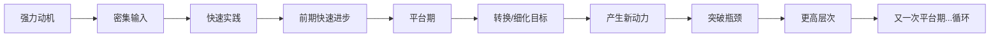

# 我的术道经验审计表（已填版）

> 根据你的回答汇总，你有补充随时说

## 一、学习科目速览

| 学习领域 | 动机 | 是否学成 | 自评深度（1-5） | 关键突破 |
|---------|------|---------|---------------|---------|
| **自由泳** | 兴趣/爱好 | ✅ 是（能游700-800米） | 4 | 转换目标法：学会→学前交叉式+两次打腿 |
| **项目管理** | 职称资质 | ⚠️ 有条件地完成 | 3 | 以终为始 + 硬啃 + 刷题巩固 |
| **营销** | 创业/自由职业/解决实际问题 | ❌ 未学成 | 2 | 记了但无法运用，理论与实践脱节最严重 |
| **管理（人员管理）** | 工作所需 | ❌ 感觉不够深 | 2 | 学了但应用有限，体系没建立 |
| **AI（智能体方向）** | 兴趣+自我实现/财务自由 | 🔄 进行中 | 3 | 能配置使用但做不出高质量Skill |
| **软考/资格考试** | 职称提升 | ✅ 是（考过了） | 3 | 反复多听+刷题，以终为始 |

## 二、学成 vs 未学成的对比

| 维度 | 自由泳（学成 ✅） | 营销（未学成 ❌） | AI智能体（进行中 🔄） |
|------|----------------|----------------|------------------|
| **初心** | 学会自由泳泳姿 | 解决实际销售问题 | 兴趣+自我实现 |
| **学习方式** | 看视频→下水实践→反复调整 | 看书/听课→记住了→用不出来 | 读文章→配置尝试→做产品 |
| **卡住什么** | 换气、打腿节奏、动作协调 | 知识在脑袋里但无法输出 | 知道怎么用但做不出高质量Skill |
| **怎么突破的** | 转换目标（细化+分解）+坚持练习 | ❌ 没突破，至今卡住 | ❌ 还没找到突破口 |
| **自评深度** | 4分（有体系、能教人） | 2分（记住了但不会用） | 3分（能用但不够精） |

## 三、你学成的模式：自由泳突破路径

关键发现：**你学成的方式是「问-做-调」循环**，而且你善于在平台期用「转换目标」来自我驱动。这个模式在自由泳上成功了，在管理/营销上因为缺乏实践场域而没走通。

## 四、AI智能体现在的卡点

| 你自评的层次 | 表现 | 差距 |
|------------|------|------|
| 第1层（基本认知）| ✅ 知道智能体是什么 | - |
| 第2层（懂原理+区别）| ✅ 理解Agent vs LLM的区别 | - |
| 第3层（能配置使用）| ✅ 能完成开发任务 | - |
| **第4层（炉火纯青的优化）** | ❌ 做不出高质量Skill | 看到别人的skill觉得自己差距很大 |
| 第5层（一人公司）| ❌ 还没到 | - |

**核心卡点：你知道"怎么做"但不知道"怎么做好"。** 就像自由泳刚学会的阶段——能游，但换气费力、动作不协调。你处在AI智能体的「平台期」。

这个平台的突破方式，根据你自由泳的经验，可能是：**把「学会用AI智能体」这个模糊目标，细化为一个可执行的小目标。**

你需要先回答：**你下一个要攻克的「高质量Skill」具体是什么？选一个。**

应该是那个公众号排版Skill对吧？因为你说过“像能做出公众号排版skill的那些人那样”。
