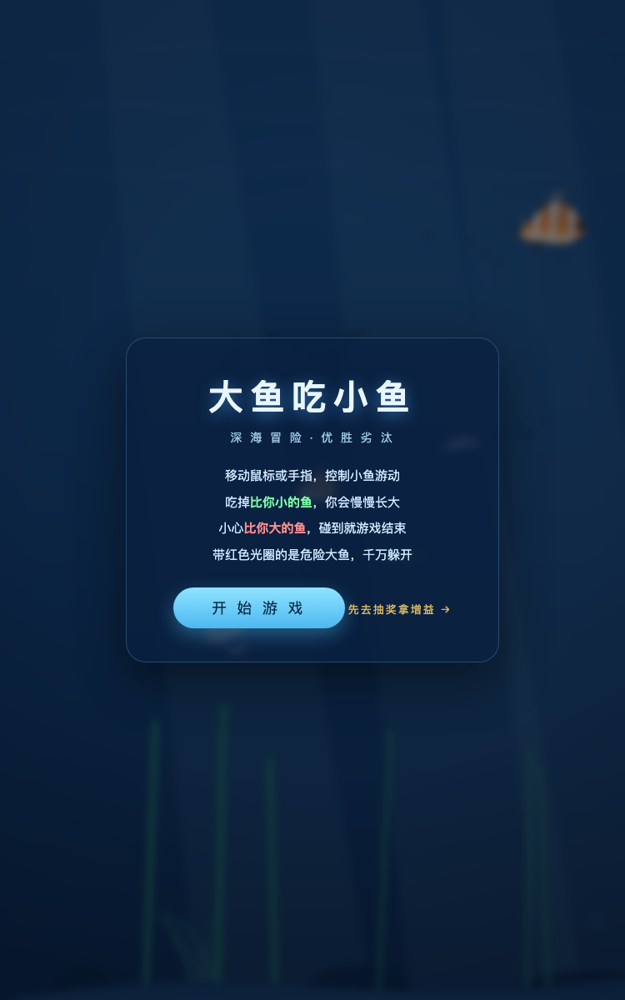
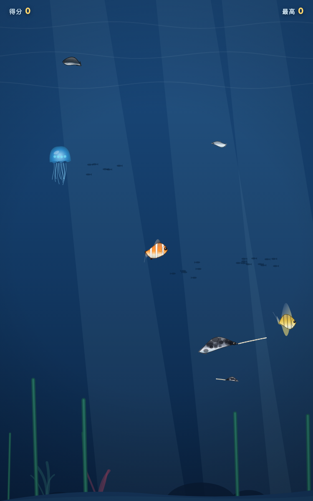
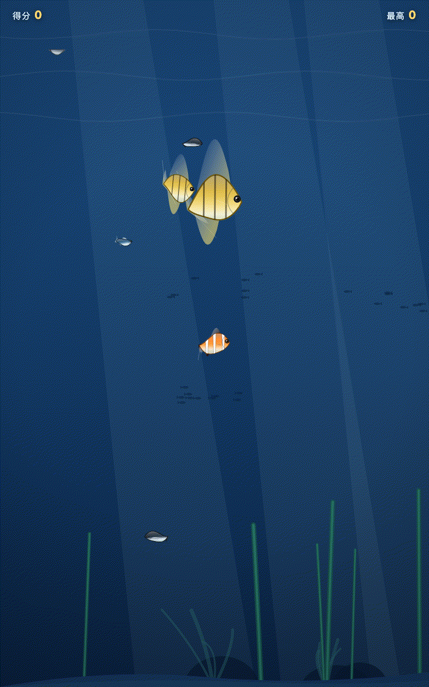

学校教儿子配C++环境，我带他一小时做了个游戏

开学第一件事，学校通知家长给孩子报兴趣班，我们报了信息奥赛。

按流程，要先上一个线上先修课，考核合格，才能继续上线下课程。作为IT行业干了二十多年的人，这事我本来挺高兴——不管将来竞赛成绩怎么样，早接触编程总没坏处。

上周我跟着孩子一起听了第一节线上课。

第一课讲什么呢？安装开发环境。下载什么软件、怎么配置、路径设在哪，然后照着屏幕敲下人生第一行程序代码，在黑乎乎的窗口里打印出一行字。

我坐在旁边，看着屏幕，心里越来越沉默。

不是老师讲得不好。是这条路本身，让我这个成年人都有点坐不住：一上来就是环境配置、语法规则、机器语言一样的代码——没有为什么，先照着做。孩子坐在旁边，眼神从好奇变成茫然，只用了十分钟。

下课我问他，有意思吗？

他说，没意思。

01

先说清楚，我不是要否定信息奥赛。

竞赛有竞赛的价值，算法训练对思维的塑造是真的。如果孩子将来想走这条路，该练的一样都不能少。

我想说的是另一件事：这节课让我看清了一个正在发生的变化——

我们教孩子学编程的方式，是为一个已经结束的时代设计的。

以前的逻辑是这样的：你想用计算机做东西？可以。先学会跟机器说话——语法、环境、调试，啃个两三年，等你熬过了这一段，才有资格去做一个真正的作品。

这套逻辑的前提是：人和机器之间隔着一层翻译层。你不掌握翻译，机器不理你。

但现在，AI把这层翻译拿掉了。

02

上完那节信奥课的同一周，我带儿子做了另一件事。

他平时喜欢玩游戏，有一天说，要是能有个自己的游戏就好了。

搁在两年前，这话我只能笑笑——想做出一个游戏，你得先学编程语言学个大半年。但现在我说：行，我们直接做。

我们用的是vibe coding的方式：他负责说想要什么，我引导他把想法说清楚，AI负责把想法变成代码。他一个编程语法都没学过，整个过程中敲的每一行需求都是大白话。

不到一个小时，他的游戏做出来了。

就是下面这个——大鱼吃小鱼，深海冒险。

画风是深海蓝，有光柱、水草和珊瑚。海里的生物不是随便画的——水母拖着触须，小丑鱼带着条纹，鳐鱼甩着斑点长尾，每种鱼有自己的花纹和游动姿态。玩法上，吃掉比你小的鱼会慢慢长大，碰到比你大的鱼就结束，带红光圈的危险大鱼得躲着走。更有意思的是，他还做了一个配套的抽奖页面——抽到奖，游戏里会刷出一条金色稀有鱼，吃到双倍成长；最高分自动存档，下次接着破纪录。连音效都是配好的。

我玩了几局，说实话，比我预想的好得多。不是那种敷衍的demo，是一个完整的小游戏：有开始界面，有得分和最高分记录，有游戏结束的重开逻辑。

整个过程里，他做的事是：想要什么，说清楚；做出来了，玩一下；不满意，再说。他全程没有背过一个语法，没有配过一次环境。

但他确实做了一个游戏。一个属于他自己的游戏。

03

这两件事放在一起，给了我很大的冲击。

信奥班那条路，是先学两年基础，再做东西。我儿子这条路，是先做东西，学到什么算什么。

哪个对？

我以前的答案会是：基础重要，先学基础。现在我的答案变了。

因为我亲眼看到，一个零基础的孩子，在"我想做一个游戏"这个念头的驱动下，自己就把该弄明白的东西弄明白了——鱼怎么变大、大鱼怎么追他、什么时候出稀有鱼。他是为了实现想法而提问，而不是为了完成作业而背诵。

创造欲是天生的，孩子本来就有。以前它被挡在一堵墙外面，墙的名字叫"基础知识不够"。现在AI把这堵墙拆了。

04

信奥课之后，我还给儿子搭了另一个东西：一个学习用的智能体。

它能干什么？他学习中不懂的问题可以随时问；作业写完可以帮忙检查；做错的题自动记下来，隔段时间带他回顾之前的知识点。

这些功能听起来都不新鲜，市面上学习机都有。但有一个区别是本质性的：

学习机是厂家的产品，服务所有孩子。而这个智能体，服务的是他一个人。他每一次提问、每一道错题、每一个薄弱点，都会沉淀在这个智能体里——用得越久，它越懂他。

这意味着什么？

意味着他从现在开始用这个东西，到他小学毕业、中学毕业，十年时间，会沉淀出一个属于他自己的个人知识库。这个知识库里装着他全部学过的知识、犯过的错、问过的问题。

再往后想一步——这个知识库不会消失，它会陪着他进入大学、进入工作。到时候它就不只是学习知识库了，是他的第二大脑。

我们这代人折腾了半天的个人知识库，在我儿子这里，起点是一年级。

05

所以回到开头那节信奥课。

学校的安排没什么错，大多数老师和课程设计者也没有错——他们只是在用自己被教育的方式教育下一代。

但时代变了。

以前，创造是一件门槛很高的事。你要做出一个作品，得先有扎实的学科基础，有广的知识面，有几年的功底。所以教育的一切设计，都围绕"先储备，再创造"展开：先学十年，再做东西。

现在，创造这件事的门槛，正在塌掉。

想做个游戏？直接做。想做个工具？直接做。想法说清楚，AI帮你落地。知识不够用怎么办？做到哪问到哪——知识变成了创造的副产品，而不是入场券。

我认为未来的教育一定会发生一个顺序上的颠倒：从"先学习，再创造"，变成"先创造，学习自然发生"。

这不是我的一厢情愿。你看我儿子就知道：没有一个孩子对"配置开发环境"感兴趣，但几乎每个孩子都对"做出一个自己的游戏"感兴趣。兴趣一直都在，只是以前的墙太高，兴趣进不去。

当这堵墙塌了，会发生什么？

每一个孩子都能创造，每一个想法都能被低成本验证。全球的创造力会以前所未有的密度爆发——就像印刷术把知识的获取门槛打掉、互联网把信息的传播门槛打掉一样，这一次，AI把创造的门槛打掉了。

上一次，我们进入了信息时代。

这一次，人类也许会真正进入一个由创造驱动的次世代。

06

写到这，我想起信奥课下课后，儿子问我的一句话。

他指着屏幕上那行打印出来的字符问我：爸爸，我以后是不是就能做游戏了？

我说：你上周不就做过一个吗？

我们这一代人还在讨论孩子该不该学编程。

而孩子们已经开始造游戏了。

你家孩子在怎么学编程？留言区聊聊。

（完）
